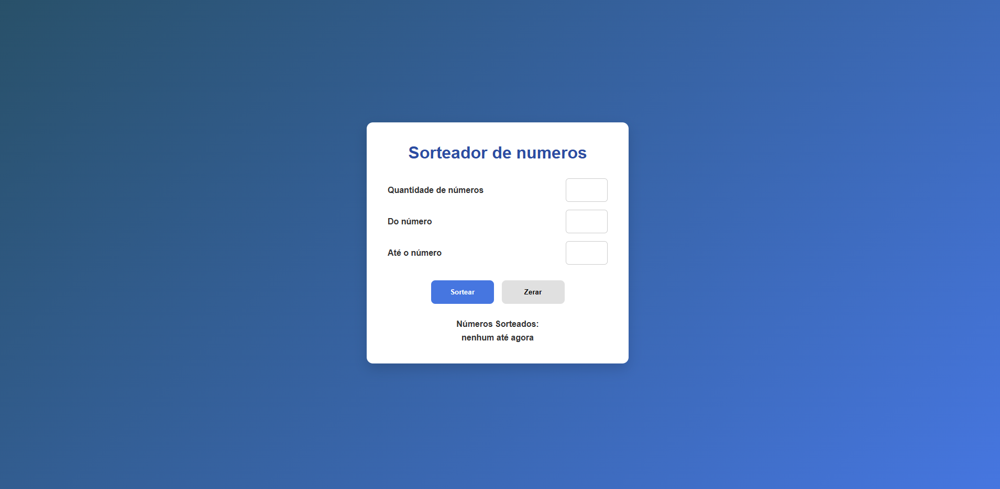

🚀 Sorteador de números

Projeto de sorteador de números desenvolvido durante meus estudos na plataforma Alura, com o objetivo de praticar JavaScript, lógica de programação e manipulação do DOM. A aplicação permite definir intervalos personalizados e realizar sorteios de forma interativa.

📸 Preview

🔗 Demo online

https://tgusbc.github.io/Sorteador-de-numeros/

🛠️ Tecnologias utilizadas

HTML5

CSS3

JavaScript